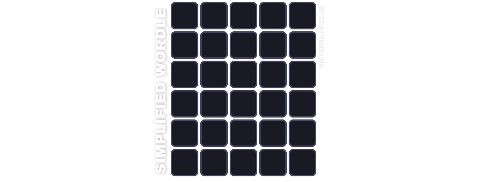

# Simplified Wordle
 Một phiên bản đơn giản của trò chơi Wordle, được phát triển cho bài tập lớn cho môn **Lập Trình Nâng Cao**.
 
 Xem Video Demo cách chơi [tại đây.](https://drive.google.com/file/d/1Zy1dSHkcFeDH7cb4ViUYGUAe4F4b3M0a/view?usp=sharing)
## Hướng dẫn cách chơi
 Với mỗi vòng chơi, nhiệm vụ của người chơi là tìm ra từ bí mật gồm 5 chữ cái, người chơi có thể đoán tối đa 6 lần. 
 
 Mỗi lần người chơi nhập 1 từ, người chơi sẽ nhận được gợi ý dựa vào màu từng ô chữ. Cụ thể:
 - **Xanh lá** : Chữ cái đúng và đúng vị trí. 
 - **Vàng**: Chữ cái đúng nhưng sai vị trí. 
 - **Xám**: Chữ cái không có trong từ. 
 
Trò chơi sẽ kết thúc khi người chơi đã đoán ra từ đó hoặc đã hết lượt đoán.

_**Lưu ý:**_ Người chơi có thể từ bỏ giữa chừng bằng cách bấm vào nút _"Give up"_ ở góc trên bên phải. 

## Cách thêm từ vào Wordle
 Việc thêm từ vào danh sách từ có sẵn sẽ làm cho mỗi lần chơi trở nên phong phú hơn. Dưới đây là cách thêm từ vào game.

 **Cách thực hiện**

 1. Mở file `wordlist.txt` tại đường dẫn: `src/wordlist.txt`.
 2. Thêm mỗi từ vào dòng mới hoặc sau mỗi dấu cách và đảm bảo từ đó:
    - Phải có **chính xác 5 chữ cái**.
    - Dùng các **chữ cái tiếng Anh** (a-z).
    - Không sử dụng kí tự đặc biệt, số hoặc dấu câu.

 > [!WARNING]
 > Nếu không thêm từ đúng cách có thể dẫn tới chương trình có thể hoạt động không đúng.

 _Ví dụ file `wordlist.txt` chuẩn_ :
```
apple mango
handy bulky
happy junky
```
